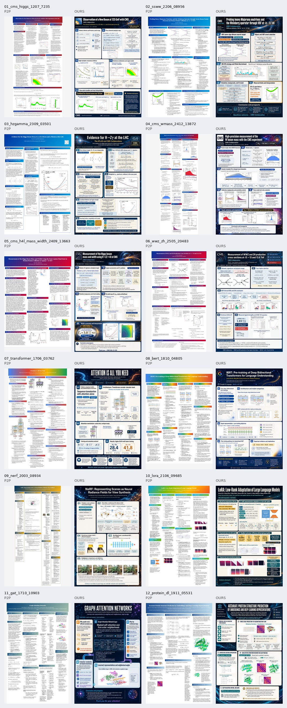

<p align="center">
  
</p>

<h1 align="center">Paper Poster Harness</h1>

<p align="center">
  占位符优先的 LLM + 生图学术海报生成框架：让模型负责设计，但不让模型伪造科学图表。
</p>

<p align="center">
  <a href="README.md">English</a> ·
  <a href="README.zh-CN.md">简体中文</a> ·
  <a href="docs/i18n/README.ja.md">日本語</a> ·
  <a href="docs/i18n/README.es.md">Español</a>
</p>

<p align="center">
  
</p>

## 这是什么？

Paper Poster Harness 是一套严格、可审计的自动海报生成流程。核心思路是：

> **LLM/生图模型负责版式和艺术性，但科学图表必须来自论文原图。**

生图模型先生成带 `[FIG 01]` 等空白占位符的海报模板；框架随后检测这些占位符的像素位置，并把论文或 arXiv 源码包里的真实图表确定性贴入。如果任一步 QA 失败，就报错或整张重生图，不会悄悄退化成拼贴旧海报或整页 PDF 截图。

## 为什么要占位符优先？

生图模型可以画出非常像真的科学图，但曲线、误差棒、事件显示、费曼图都可能是假的。学术海报不能接受这种风险。

| 环节 | 谁负责 | 原则 |
|---|---|---|
| 版式、配色、字体、背景艺术 | 生图模型 | 充分发挥设计能力 |
| 科学图表 | 确定性替换 | 只使用论文真实图片 |
| 海报文案 | LLM 规划 + 过滤 | 从论文提炼，公开可展示 |
| 质量控制 | VLM + 确定性检查 | 占位符、贴图、文字不过 QA 就拒绝 |

## 快速开始

```bash
# 1. 安装
git clone https://github.com/tyy99phy/paper_poster_harness.git
cd paper_poster_harness
pip install -e .

# 2. 初始化配置并登录本地 ChatGPT/OpenAI 账号
poster-harness init-config --out poster_harness.yaml --login

# 3. 从 arXiv 生成海报
poster-harness autoposter \
  --config poster_harness.yaml \
  --arxiv-id 2206.08956 \
  --out runs/ssww-demo

# 可选：HEP 高信息密度模式
poster-harness autoposter \
  --config poster_harness.yaml \
  --arxiv-id 2206.08956 \
  --content-mode hep_dense \
  --out runs/ssww-demo-dense
```

最终海报在 run 目录的 `exports/` 下。

## 流程

```text
PDF / arXiv ID / 本地源码
  → 提取文本和真实图表
  → 自动识别领域 profile（HEP、CS/ML、Bio、Astro、Math、Chemistry、Generic）
  → 规划内容、storyboard、copy deck、figure roles
  → 给每个 [FIG NN] 选择论文真实图表
  → 组装严格 prompt 并调用生图模型
  → 生成只含空白占位符的海报模板
  → template critic 检查设计、信息量、文字和占位符契约
  → 检测占位符坐标
  → placeholder QA / containment QA
  → 确定性贴入真实论文图片
  → 放大导出
  → final QA
  → 仅在少量公开文字/符号 typo 时进行 image-edit micro repair，然后重新检测/贴图/QA
```

所有中间产物都会保留：prompt、spec、figure manifest、检测结果和 QA 报告。

## 模式

| 模式 | 默认 | 特点 | 场景 |
|---|---:|---|---|
| `standard` | 是 | 稳定、通用、信息量适中 | 跨学科日常生成 |
| `hep_dense` | 否 | HEP 专家信息密度更高，强调 selection、SR/CR、fit、systematics、limits | HEP 论文和 benchmark |

## Selected 12 benchmark

仓库包含一个精简的 12 篇定性 benchmark：[`benchmarks/selected_12`](benchmarks/selected_12)。

- 6 篇 HEP + 6 篇非 HEP。
- 每篇 2 张海报：我们的 `ours.png` 和修正后的 P2P `p2p.png`。
- P2P 对照已修正：受影响样本不再使用整页 PDF 截图 fallback，而是使用真实 figure cache。

## 配置重点

完整模板见 `templates/poster_harness_config.yaml`。

```yaml
llm:
  backend: chatgpt_account
  model: gpt-5.5

image_generation:
  backend: chatgpt_account
  model: gpt-5.5
  size: 1024x1536
  quality: high

autoposter:
  required_successes: 2
  max_candidate_batches: 3
  content_mode: standard
  domain_profile: auto
  template_critic:
    enabled: true
    require_pass: true
  micro_repair:
    enabled: true
    backend: image_edit
```

认证凭证只保存在用户本地，仓库不包含任何账号 JSON 或 API key。
